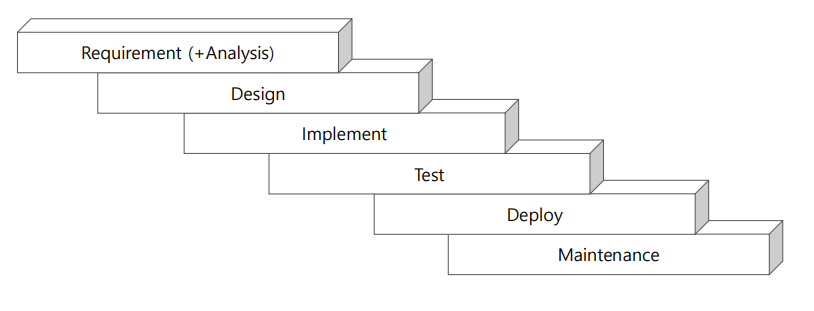
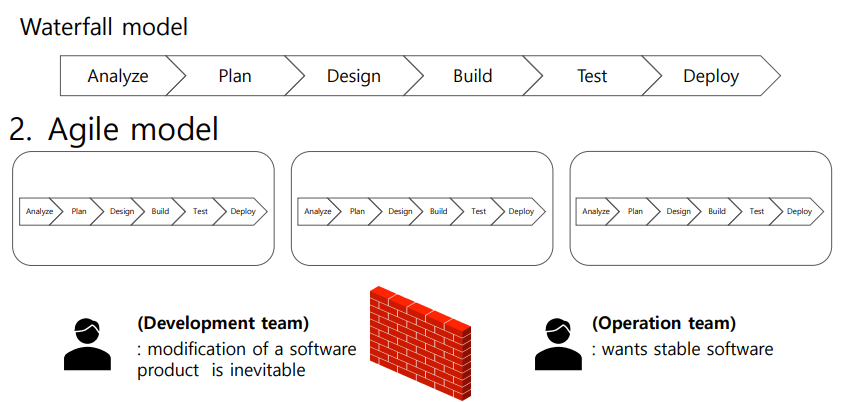
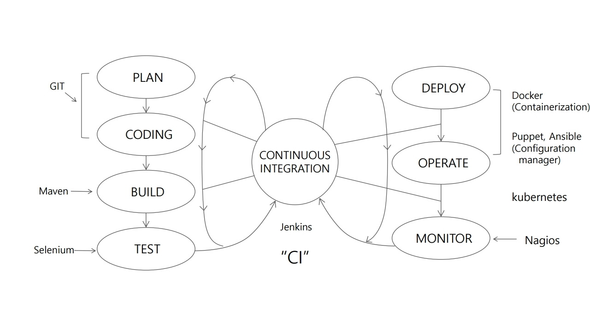

<h1 align="center">Software Engineering</h1>

> This is a repository for 'Software Engineering' Class of Hongik Univ.
> This is a repository for 'Summary of Software Engineering' Class of Hongik Univ.

# 1. Git & Github
# 1. Software Development methodology
## (1) Waterfall model - 말도 안됨 ㅎ


### 문제

1. High Risk + Uncertainty
2. 최종 단계에 가서야 동작하는 SW 가 생산됨
3. 테스트 단계에서 단점이 발견되어도 수정하기 어려움
4. Requirement들이 자주 변경되는 SW 개발에 적용하기 어려움
5. 복잡한 SW 개발에 부적절
6. Object Oriented 프로젝트에 부적절

## (2) Agile Methodology

- Waterfall 모델을 개선하려고 전체 개발 프로젝트를 여러 단계의
- iteration으로 나눈 것
- 각 iteration 의 소요 시간은 동일해야 하며 대략 2~8주
- 각 iteration 마다 정해진 기능이 동작하는 SW 생산됨
    

## (3) 결론

- "**구현 기술**"이 이러하기 때문에 이렇게 개발해야 한다 → 망하는 지름길
- "**목표**"를 결정 → 구현가능한 엔지니어를 고용해야함


# 2. 현재의 개발 방법론 및 Solution

## CI/CD(Continuous Integration / Continuous Delivery(Deploy))

- CI/CD 파이프라인은 더 자주 더 신뢰성 높은 수정된 코드를 deploy 할 수 있도록 DevOps 팀이 SW를 구현하는 방법
- Object Oriented SW design/implementation 기술 발전에 기인, 실제 복잡한 SW 개발자들의 누적된 경험에 의한 팀 문화적 산물
- DevOps SW 개발 도구들의 발전으로 꽃을 피우기 시작 
  -> DevOps 도구들을 사용하면 CI/CD가 강제적으로 수행됨

## DevOps

= CI / CD Methodology realized by a set of automation tools
    
    

### DevOps 의 작동 방식

1. Continuous Development
2. Version control – **Git**, SVN
3. Automatic builder/packager to executables – Maven, Ant, Gradle
4. Continuous Testing – **Selenium**
5. Continuous Deployment – 실행 파일을 특정 서버 (테스팅 서버, production 서버)에 배포

    (a) Containerization (vs VM) – **Docker** + **Docker Swarm**

    (b) Configuration management – Puppet, **Ansible**

6. Continuous Monitoring – 네트워크 모니터링과 배포된 소프트웨어의 버그 및 사용자로부터의 feedback 수집 – **Nagios**
7. Continuous Integration – 위 모든 SW lifecycle의 도구들을 연합하고 연속적이고 자동적으로 각 작업이 수행되도록 함, 모든 위 도구들과 연동
    - **Jenkins** – 300개 이상의 plug-ins
    - cf) Kubernetes – Docker container orchestration manager (vs docker swarm)


# 3. Git & Github
### 목적 : Version Control

### DevOps 중 -  Version control 에 해당

## 특징

- 분산 **VCS** (Version Control System)
- 다수의 개발자간 협력을 용이하게 하는 도우
- 코드 수정에 대한 tracking
- 수정 이력 편집 가능
- Local / Remote Repository

## Assignment1

### static website using github and template

> hosting url : https://justzino.github.io/hongik-software-engineering/

# 2. Docker

## Apache-docker 실습

### Process

#### 1. Create AWS EC2 instance & Install Docker on ubuntu

```shell
$ apt-get update
$ apt-get install docker.io
$ docker --version
```

#### 2. Add a Dockerfile for apache server

- code : [apache server Dockerfile](hw2-wordpress\docker-compose.yml)

```dockerfile
FROM ubuntu
ARG DEBIAN_FRONTEND=noninteractive
RUN apt-get update
RUN apt-get install -y apache2
ADD . /var/www/html
ENTRYPOINT apachectl -D FOREGROUND
ENV test TestingENV
```

#### 3. Image build -> run

- port forwarding
- volume mount

#### 4. mount 시킨 ubuntu의 volume에 html 파일 생성 및 변경 후 container에 잘 적용 되었는지 확인

### Commands

#### 1. Docker Commands

```shell
$ docker pull ubuntu
$ sudo docker run -it -d [ubuntu]
$ sudo docker exec -it [container ID] bash
$ sudo docker build . -t [생성할 image이름]
# $ sudo docker run -it -p 5000:80 -v /home/ubuntu/[디렉토리 이름]:/var/www/html -d [image이름]
$ sudo docker run -it -p 5000:80 -v /home/ubuntu/docker:/var/www/html -d [image이름]

$ sudo docker rm -f $(sudo docker ps -a -q)
$ sudo docker rmi -f $(sudo docker images -a -q)
```

- /var/www/html/ 에 volume을 마운틴하는 이유 : apache의 index.html 파일이 해당 경로에 위치해 있기 때문
- /var/www/html/tmp.html 생성후 `서버주소/tmp.html` 접속 -> 제대로 mount 적용 되는지 확인

#### 2. Apache Commands

```shell
$ service apache2 status
$ service apache2 start
```

# 3. docker-compose

## Assignment2

### wordpress, php, docker-compose를 사용한 웹 서비스 만들어 보기

- wordpress를 사용한 브라우저를 EC2 서버에 올리기

- 클라이언트에서 form 또는 button 같은 document object를 click 하여 서버로 데이터를 보내고 전송 받은 데이터에 따라 적절히 서비스를 다시 클라이언트에게 제공하는 dynamic 서비스를 wordpress를 이용하여 container로 만들어 봅니다.

- 만일 브라우저에서 데이터를 웹 서버에 보내어 그에 따라 서버가 여러분이 정해 놓은 작업을 수행하는 dynamic 서비스를 구현하는 방법을 모르거나 해 본 적이 없는 사람은 지난 번 static 웹 사이트 과제처럼 자기 이름 학번을 보여주는 wordpress 를 이용한 웹 서버를 container 로 만들어도 됩니다.

- dynamic 서비스를 만들 줄 아는 사람도 그냥 간단히 브라우저에서 이름을 입력하면 "안뇽, <입력한 이름>"이 브라우저에서 rendering 하는 매우 간단한 프로그램으로 충분하니 복잡한 서비스를 구현하여 너무 자랑하지 말기.

### Process

#### 1. docker-compose 설치

```shell
$ sudo curl -L https://github.com/docker/compose/releases/download/1.29.0/docker-compose-`uname -s`-`uname -m` -o /usr/local/bin/docker-compose
$ sudo chmod +x /usr/local/bin/docker-compose
$ docker-compose --version
```

#### 2. docker-compose.yml 추가

- [wordpress compose file 참고](https://docs.docker.com/compose/wordpress/)

```yml
version: "3.9"

services:
  db:
    image: mysql:5.7
    volumes:
      - db_data:/var/lib/mysql
    restart: always
    environment:
      MYSQL_ROOT_PASSWORD: somewordpress
      MYSQL_DATABASE: wordpress
      MYSQL_USER: wordpress
      MYSQL_PASSWORD: wordpress

  wordpress:
    depends_on:
      - db
    image: wordpress:latest
    ports:
      - "8000:80"
    restart: always
    environment:
      WORDPRESS_DB_HOST: db:3306
      WORDPRESS_DB_USER: wordpress
      WORDPRESS_DB_PASSWORD: wordpress
      WORDPRESS_DB_NAME: wordpress
volumes:
  db_data: {}
```


# 4. Swarm

## swarm 개념

- 각 Container들을 cluster 하고 schedule 하여, 전체 Container 클러스터를 하나의 virtual 단일 Container로 관리
- 각 Container의 상태를 모니터링하여 컨테이너 수를 각 호스트에서 늘리거나 줄이며 운영하는 도구
- **여러 호스트에서** 다수의 컨테이너들을 운영(orchaestrate), 필요에 따라 컨테이너의 수를 늘리고 줄이는 auto-scaling 기능

  

## 실습

### swarm을 이용하여 여러 호스트에서 다수의 Apache server 컨테이너 운영

### Process

#### 1. AWS EC2 instance 2 개 이상 생성

- master, workers instances
- 각 ubuntu 에 docker 설치

#### 2. master, worker ubuntu에 동일한 image build (or pull)

- 이 경우 위에서 사용했던 apache Dockerfile을 사용하여 image build

#### 3. master 노드에서 swarm init

```shell
$ sudo docker swarm init --advertise-addr=[private IP address]

$ sudo docker service ls
$ sudo docker node ls
$ sudo docker ps
```

> 결과
>
> ```shell
> Swarm initialized: current node (vhykgsb3y716xyy272ac2dvn0) is now a manager.
>
> To add a worker to this swarm, run the following command:
>
>     docker swarm join --token SWMTKN-1-2xlodjb3k3hqtyijpkxgb6dvhknwyy7ggkjkjdjbh31j6v8rm2-1n6zhwapbhzxq2txtsmkxqfkt [private IP address]:port
>
> To add a manager to this swarm, run 'docker swarm join-token manager' and follow the instructions.
> ```

#### 4. worker node 에서 swarm 으로 join

- 위의 swarm init 결과로 나온 command 를 worker node에서 실행

```shell
$ sudo docker swarm join --token SWMTKN-1-2xlodjb3k3hqtyijpkxgb6dvhknwyy7ggkjkjdjbh31j6v8rm2-1n6zhwapbhzxq2txtsmkxqfkt [private IP address]:port
```

#### 5. replicas 생성, 제거, scale 관리
- 아래의 commands 참고

### Commands

#### master node Commands

- Create a service (private IP 에 주의)

```shell
$ sudo docker swarm init --advertise-addr=[private IP address]
# $ sudo docker service create --name [service name] --replicas [num of replicas] -p [port mapping] [image name]
$ sudo docker service create --name apache --replicas 5 -p 5000:80 test
```

- Scale-up and down

```shell
# $ sudo docker service scale [service name]=[num of service instances]
$ sudo docker service scale apache=7
```

- ps list

```shell
$ sudo docker service ls
$ sudo docker node ls
$ sudo docker ps
```

- Remove a service

```shell
$ sudo docker swarm leave --force     # on master
# $ sudo docker service rm [service name]
$ sudo docker service rm apache
```

#### worker node Commands

- Connect to swarm

```shell
$ sudo docker swarm join --token SWMTKN-1-2xlodjb3k3hqtyijpkxgb6dvhknwyy7ggkjkjdjbh31j6v8rm2-1n6zhwapbhzxq2txtsmkxqfkt [private IP address]:port
```

- ps list

```shell
$ sudo docker ps
```

- Remove a service
```shell
$ sudo docker swarm leave     # on worker
```

# 5. Kubernetes(k8s)
작성 예정  

# 6. Configuration Management tools (형상 관리)
### 실습에서는 Ansible을 사용
## 개념
### Configuration Management tools

- Why automated CM?
    - 대규모 heterogeneous computer cluster 관리
        - 수백~수천~수만 대 이상 서버/1500대 규모의 네트워크 장비
    - HW 모니터링
    - SW install
    - DevOps 중 Deploy 과정에 해당되는 도구
    - Environment 불일치 문제 해소 (cf. containerization)
    - Roll back 자동화
    - 부실한 CM은 Service Downtime에 xx가장 큰 요인
- IT Automation의 기본 도구

### IaC (Infrastructure as Code)

- 수작업이 아닌 code를 제공하여 IT operations (build, deploy, manage)을 자동화하는 것
- 중앙에서 코드를 write하여 수백 대 이상의 기기에 Dev, Test, Production 환경을 제공(provisioning)함

### Shell script vs CM tool script

- 각 서버/기기에 환경을 provisioning 하는 점에서는 동일 목표
- Shell script로 관리를 위한 코딩을 한다는 것은 모든 것을 scrip로 구현하는 것  
  → workflow/숙련도/일관성/upgrade 이슈
- CM script는 훨씬 편리 → 이슈를 제거/자동처리
- CM Tool UI

### Puppet vs Chef vs Saltstack vs Ansible
- 어느 도구가 상대적으로 우수하다고 할 수 없음
1. Scalability
    - 4 개 도구 모두 scalability 우수 (수천 대 이상의 기기 동시 관리)
2. Ease of setup
    - Puppet/Chef/Saltstack : master-agent
    - Ansible : master only => fast (and **easy**) setup
3. Availability → Backup
    - Puppet, Saltstack : multi masters
    - Chef : backup chef
    - Ansible : primary/secondary server
4. Management
    - Puppet : not easy, DSL(domain specific language)
    - Chef : Ruby DSL program, not easy
    - Saltstack : easy to medium
    - Ansible : Easy (yaml)
5. Interoperability
    - Puppet, Chef, Saltstack : master only on linux
    - agents are on linux/windows
    - Ansible : sever on linux (as well as windows), clients on linux/windows
6. Configuration Languages
    - Puppet : Puppet DSL, not easy, admin 편의
    - Chef : Ruby DSL, difficult, 개발자 편의
    - Saltstack : YAML built on Python, easy
    - Ansible : YAML built on Python, easy
7. 인기도
    - Puppet/Chef : 점점 인기도 떨어짐
    - Saltstack : 낮음
    - Ansible : 현재 가장 널리 사용됨
8. 비용
    - 대략 연간 10,000달러 / 1,000대 기기
9. 누가 사용하나?
    - 모든 회사

## 실습
실습을 위해 EC2 instance 2개 준비: Master + Node

### 설치
두 서버에 모두 ansible 설치
```shell
$ sudo apt-get update
$ sudo apt-get install -y ansible
$ sudo ansible --version
```

### master 서버 설정
```shell
$ cd /etc/ansible	# default inventory file
$ sudo vi hosts
```
- [webservers] 주석 풀고, 아래에
- 배포할 node 서버의 <Private IP address> 입력 (ex.172.31.xx.xxx)
  

### Ansible ad-hoc commands (playbook에 기재하지 않고 필요할 때 실행시키는 명령)
#### master 기계에서 연결 확인
```shell
$ ansible all --list-host   # hosts 확인
# 연결이 되었는지 확인
# $ ansible <group name> -m ping
$ ansible all -m ping     # hosts 에 등록한 ip와 secure shell 연결이 되어있지 않아서 오류 발생
$ ansible webservers -m ping
```

#### master 기계에서 node 로 ssh 연결을 위한 설정
hosts 에 등록한 private ip 와 secure shell 연결을 위한 key 생성
```shell
$ sudo su -   # 실습상황에선 편의를 위해 root 권한으로 진행
$ ssh-keygen    # /root 에서 진행중
$ ls -la
$ ls .ssh
$ ssh-copy-id <private ip address of nodes>   # node에서 설정을 해주지 않아 오류 발생
```

#### node 기계에서 ssh 연결을 받아들이기 위한 설정
```shell
$ ls -la /etc/ssh
$ sudo vi /etc/ssh/sshd_config    # sshd_config 파일 수정
---
  PasswordAuthentication yes
  PermitEmptyPasswords yes
  PermitRootLogin yes
---
$ systemctl restart sshd
```

#### master
```shell
$ ssh-copy-id <private ip address of nodes>
$ ssh <private ip address>    # node 기계에서 passwd root, 작동 여부 확인
```

이제 ansible을 하기 위한 사전작업이 끝

#### Playbook 을 위한 yml 파일 작성


# 7. Selenium 
| 가장 대표적인 **Automated testing suite**

### 단점
- Web app만 테스트
- 지원 프로그램 (open source community)
- Setup과 사용법 불편
- IDE integrated / PL 숙련도에 좌우됨
- No graphic reporting facility
- Image 기반 테스팅 불가 – 이미지 비교 기능 없음
### 장점
- Open source
- 여러 PL 에서 사용 가능
- 여러 web browser 지원 including headless browser
- Parallel test execution
- Supports frameworks : TestNG, JUnit, NUnit

### Webdriver
- 테스트 케이스를 생성하고 실행하는 API
  - https://webdriver.io/docs/api.html
- Provides a set of methods
- Uses DOM locators to i/o or manipulate the document objects
- 각 브라우저 별 webdriver
  - 테스트 스크립트를 작성할 여러 언어 별 method 제공
  - Java, C#, PHP, Python, Perl, Ruby
- POM(page object model) 기반 Webdriver scripting
  - Form/Click activity 기반
- Selenium RC (remote control)와 합쳐 짐 (Selenium 3)
- 빠른 execution time
  - Remote machine 에서 web 테스트할 때는 RC 사용 (느림)
- 상세한 테스트 결과보고는 (아직) 생성할 수 없음

### Selenium IDE
- 테스트 케이스를 생성하고 실행하는 plug-in
- 용자의 모든 interaction을 기록하고 재생
- record/play tool로 불림

# 8. Jenkins
### 개념

### 설치

### 실습

# Reference
- https://docs.docker.com/compose/wordpress/